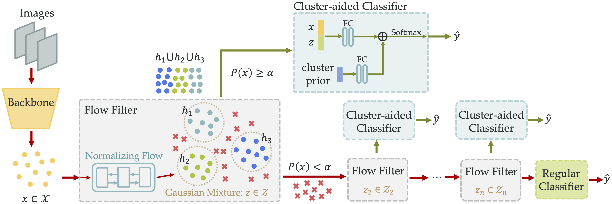

# DLSA

This is the code accompanying our ECCV'22 papers: **Constructing Balance from Imbalance for Long-tailed Image Recognition**

## Prerequisites

**Packages**: Install using `pip install -r requirements.txt`

**Features**: Train backbone models with [Decouple](https://github.com/facebookresearch/classifier-balancing.git)[2], and [PaCo](https://github.com/dvlab-research/Parametric-Contrastive-Learning.git)[3] and extract features for train and test sets. The features should be stored as `features_train.h5` or `features_test.h5` with structure:

    {
        "features": numpy.ndarray, shape = (num_sample, feature_dim),
        "labels": numpy.ndarray, shape = (num_sample, ),
    }

Please put the pretrained models and files in folder `features` and organize it as:

    features
    ├── imagenet
    │   ├── ce
    │   │   ├── feature_test.h5
    │   │   ├── feature_train.h5
    │   │   └── final_model_checkpoint.pth
    │   ├── cbs/...
    │   └── paco/...
    ├── places
    │   ├── ce/...
    │   └── paco/...
    └── inat
        └── paco/...

The pretrained feature and models will be released later.

## Training

For example, to train a DLSA on PaCo+BSM model on ImageNet-LT, run:

	python train_dlsa.py --cfg config/cls/ImgNet_PaCo_R50_bsm.yaml

## Acknowledgement
The code, data and pretrianed models are partly based on [OLTR](https://github.com/zhmiao/OpenLongTailRecognition-OLTR.git)[1], [Decouple](https://github.com/facebookresearch/classifier-balancing.git)[2], [PaCo](https://github.com/dvlab-research/Parametric-Contrastive-Learning.git)[3] and [normalizing_flows](https://github.com/kamenbliznashki/normalizing_flows.git).

## Reference

[1] [Large-Scale Long-Tailed Recognition in an Open World](https://arxiv.org/abs/1904.05160)

[2] [Decoupling Representation and Classifier for Long-Tailed Recognition](https://arxiv.org/abs/1910.09217)

[3] [Parametric Contrastive Learning](https://arxiv.org/abs/2107.12028)
